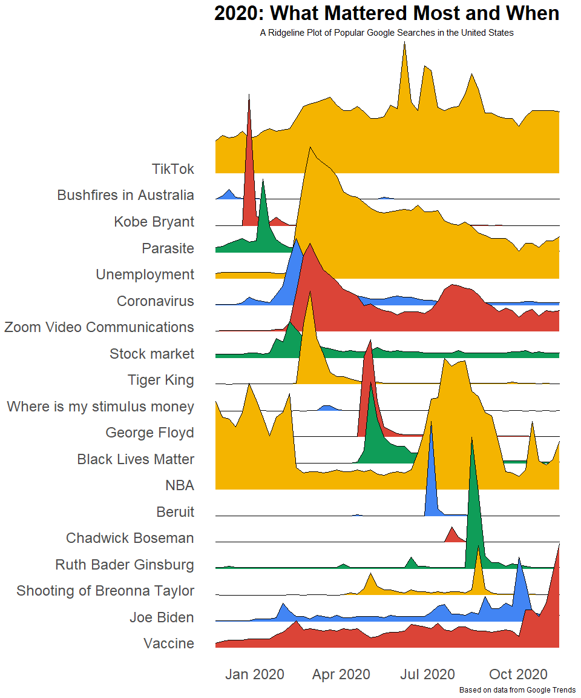

# Google Trends in 2020
Google Trends provides an anonymized, largely unfiltered database showing how frequently a given search term or topic is entered into Google's search engine. A visualization of top searches reveals who we really are. The ridgeline plot below depicts many big events of the year and how often they were searched, telling the story of 2020.

